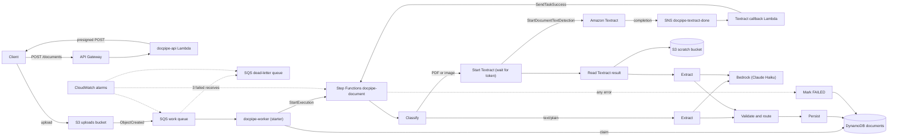

# Architecture

```mermaid
flowchart LR
  Client["Client"] -->|"POST /documents"| APIGW["API Gateway"]
  APIGW --> API["docpipe-api Lambda"]
  API -->|"presigned POST"| Client
  Client -->|"upload"| S3["S3 uploads bucket"]
  S3 -->|"ObjectCreated"| Queue["SQS work queue"]
  Queue -.->|"3 failed receives"| DLQ["SQS dead-letter queue"]
  Queue --> Starter["docpipe-worker (starter)"]
  Starter -->|"claim"| DDB[("DynamoDB documents")]
  Starter -->|"StartExecution"| SFN["Step Functions docpipe-document"]
  SFN --> Classify["Classify"]
  Classify -->|"text/plain"| Extract["Extract"]
  Classify -->|"PDF or image"| StartTextract["Start Textract (wait for token)"]
  StartTextract -->|"StartDocumentTextDetection"| Textract["Amazon Textract"]
  Textract -->|"completion"| SNS["SNS docpipe-textract-done"]
  SNS --> Callback["Textract callback Lambda"]
  Callback -->|"SendTaskSuccess"| SFN
  StartTextract --> ReadTextract["Read Textract result"]
  ReadTextract --> Scratch[("S3 scratch bucket")]
  ReadTextract --> ExtractTextract["Extract"]
  Extract --> Bedrock["Bedrock (Claude Haiku)"]
  ExtractTextract --> Bedrock
  Extract --> Validate["Validate and route"]
  ExtractTextract --> Validate
  Validate --> Persist["Persist"]
  Persist --> DDB
  SFN -.->|"any error"| MarkFailed["Mark FAILED"]
  MarkFailed --> DDB
  CW["CloudWatch alarms"] -.-> Queue
  CW -.-> DLQ
  CW -.-> SFN
```
